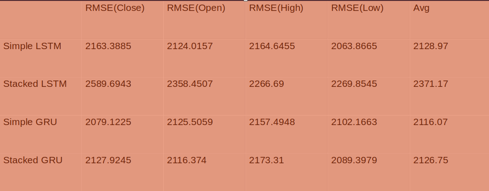

# StockPrediction
  This module aims to predict stock prices based on past data
  

## Installation:

### Prerequisite:
- Python3
- Git

### steps

- Download git repo on your machine

    `$ git clone https://github.com/sociopath00/StockPrediction.git`

- Change working directory

    `$ cd StockPrediction`
    
    
- Install Requirements and Dependancies

    `$ pip install -r requirements.txt`
`

- Train the model

    `$ python -m src.train`
    
    *Note*: If you wish to train with different dataset mention the path with `-d` argument, target variable with `-t` and model path with `-p`
    
    eg.  `$ python -m src.train -d data/train.csv -p stacked_lstm -t close`
    

- Predict the values on Test data

     `$ python -m src.predict -p stacked_lstm`
     
     
## Solution

### Data

- We have stock data of Reliance Group(RIL) from 27th August,2018 to 25th August,2020  

- Data consists of 13 columns including OPEN, HIGH, LOW and CLOSE values on given day.

### High Level Approach

- Our goal is to predict future prices, and obviously we do not need other columns and 
  we cannot predict all the values (OPEN, CLOSE, HIGH, LOW) in a single model.

- So our approach will be to select one column(say CLOSE), 
  train the model on that particular column and predict the values
  
- We will repeat the above step for OPEN, HIGH and LOW  
 
### Data Preprocessing steps

- Sort the data date wise
- Replace the column name with convenient ones
- Select only target variable from given data on which predictions to be made
- Scale the data using MinMaxScaler (0 to 1)
- Split the data into Train and Validation
- Create features based on past data, for this problem we'll use past 75 days data
- Note: We can't randomly select the Train and Validation data. It should be in order.

### ML Models
- LSTM (with only one LSTM layer)
- Stacked LSTM (with multiple LSTM layers)
- GRU (with only one GRU layer)
- Stacked GRU (with multiple GRU layers)

### Performance
- The performance of the model will be calculated using RMSE(Root mean squared error).
- First we will run the model using LSTM and set the benchmark.
- Then using different models we'll try to improve our RMSE score.

